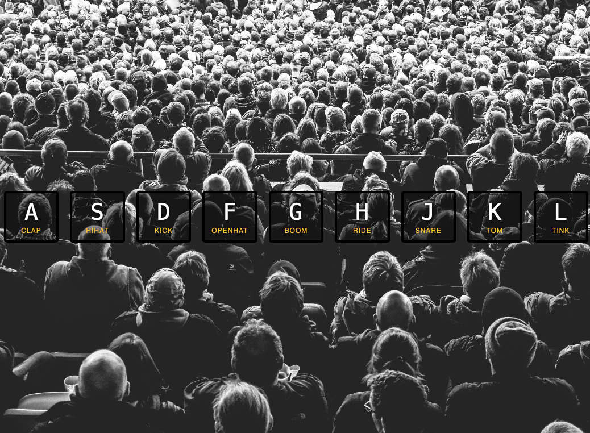

# 🎧 JavaScript Drum Kit

Este projeto é um kit de bateria virtual construído com HTML, CSS e JavaScript. O utilizador pode tocar diferentes sons de bateria ao pressionar as teclas correspondentes no teclado.

---

## 📌 Descrição
O JavaScript Drum Kit é uma aplicação interativa onde cada tecla do teclado está mapeada para um som de bateria específico. Ao pressionar uma tecla, o som toca e o botão visual correspondente é animado para indicar o input do utilizador.

---

## 🛠 Tecnologias utilizadas
- **HTML5**
- **CSS3** (animações)
- **JavaScript ES6**
- Manipulação do DOM
- Event Listeners (keydown)

---

## 🚀 Como executar
1. Clone o repositório:
   ```bash
   git clone https://github.com/teu-username/javascript-practice.git
   ```
2. Aceda à pasta do projeto:
   ```bash
   cd javascript-practice/01-javascript-drum-kit
   ```
3. Abra o ficheiro `index.html` no browser.

---

## 📸 Screenshot


---

## 📖 Notas
- Este projeto foi criado como parte de uma série de exercícios para praticar a manipulação do DOM e eventos de teclado em JavaScript.
- Possíveis melhorias: adicionar suporte para dispositivos móveis e mais sons de instrumentos.
