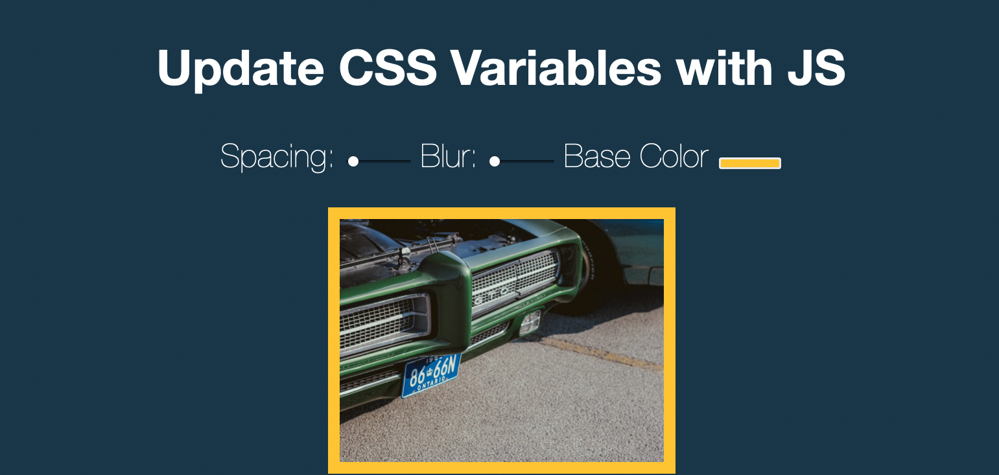

# 🎨 CSS Variables

Este projeto demonstra como utilizar variáveis CSS e atualizá-las dinamicamente com JavaScript para alterar o estilo de elementos em tempo real.

---

## 📌 Descrição
O projeto permite ao utilizador modificar propriedades CSS como cores, espaçamentos e tamanhos através de controlos de interface (sliders e inputs). As alterações são aplicadas em tempo real graças à integração de variáveis CSS com JavaScript.

---

## 🛠 Tecnologias utilizadas
- **HTML5**
- **CSS3** (Custom Properties - variáveis CSS)
- **JavaScript ES6**
- Manipulação do DOM
- Event Listeners (input, change)

---

## 🚀 Como executar
1. Clone o repositório:
   ```bash
   git clone https://github.com/teu-username/javascript-practice.git
   ```
2. Aceda à pasta do projeto:
   ```bash
   cd javascript-practice/03-css-variables
   ```
3. Abra o ficheiro `index.html` no browser.

---

## 📸 Screenshot


---

## 📖 Notas
- Este exercício é excelente para compreender como o JavaScript pode interagir com variáveis CSS para criar interfaces mais dinâmicas.
- Possíveis melhorias: adicionar mais opções de personalização e pré-visualizações de temas.
