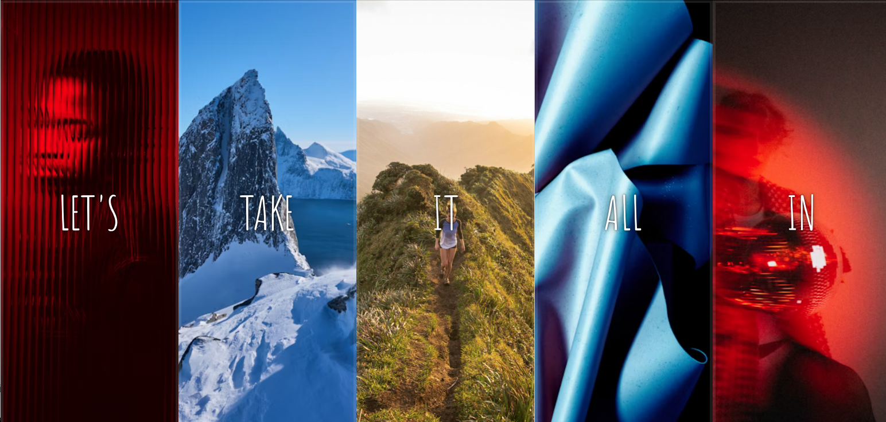

# 🖼️ Flex Panel Gallery

Este projeto é uma galeria de painéis interativos criada com HTML, CSS e JavaScript. Ao clicar num painel, este expande-se com uma animação fluida, destacando o conteúdo e criando uma experiência visual apelativa.

---

## 📌 Descrição
A **Flex Panel Gallery** utiliza CSS Flexbox para criar uma galeria de painéis que se expandem ao clicar. As animações são conseguidas através de transições CSS e classes dinâmicas adicionadas com JavaScript. Este projeto demonstra como combinar CSS moderno com JavaScript para criar interfaces dinâmicas e responsivas.

---

## 🛠 Tecnologias utilizadas
- **HTML5**
- **CSS3** (Flexbox, transições, transformações)
- **JavaScript ES6**
- Manipulação do DOM
- Event Listeners (click, transitionend)

---

## 🚀 Como executar
1. Clone o repositório:
   ```bash
   git clone https://github.com/teu-username/javascript-practice.git
   ```
2. Aceda à pasta do projeto:
   ```bash
   cd javascript-practice/05-flex-panel-gallery
   ```
3. Abra o ficheiro `index.html` no browser.

---

## 📸 Screenshot


---

## 📖 Notas
- Este projeto faz parte da série de exercícios do curso **JavaScript30** de Wes Bos.
- Possíveis melhorias: adicionar suporte a dispositivos móveis e efeitos adicionais ao abrir/fechar painéis.
